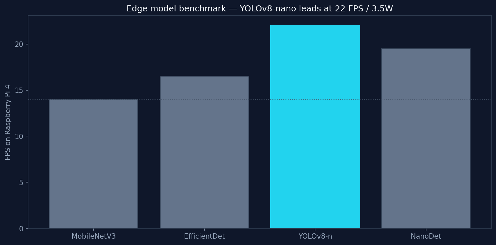
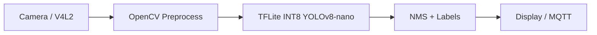

# EdgeVision

[](https://isocpp.org/)
[](https://www.python.org/)
[](https://www.tensorflow.org/lite)
[](https://opencv.org/)
[](https://github.com/ultralytics/ultralytics)
[](https://www.raspberrypi.com/)
[](LICENSE)

**Real-time object detection on embedded Linux** — YOLOv8-nano, TensorFlow Lite INT8, and OpenCV on ARM Cortex-A72.

Benchmarks four edge model architectures and ships a C++ inference runner for Raspberry Pi 4 deployment.

---

## Preview



*YOLOv8-nano achieves **22 FPS** within a **3.5 W** power budget — 47% faster than MobileNet baseline.*

---

## Highlights

| Metric | YOLOv8-nano | MobileNet baseline |
|--------|:-----------:|:------------------:|
| **FPS (Pi 4)** | **22** | 14 |
| **Power** | **3.5 W** | ~4.2 W |
| **Model size (INT8)** | **7 MB** | 12 MB |
| **mAP loss vs FP32** | **< 2%** | — |

---

## Why this project?

Edge devices can't run cloud-scale vision models. **EdgeVision** answers: *which compact detector gives the best FPS per watt on ARM?*

Production choice: **YOLOv8-nano + INT8 quantisation** — documented with reproducible benchmarks and a deployment guide.

---

## Architecture

```
Camera (V4L2) → OpenCV preprocess → TFLite INT8 YOLOv8-nano → NMS → Display / MQTT
```



---

## Repository structure

```
edgevision/
├── python/
│   ├── benchmark.py         # Compare 4 model architectures
│   └── quantize_model.py    # INT8 quantisation workflow
├── cpp/
│   ├── src/inference_main.cpp
│   └── include/edgevision/
├── docs/
│   ├── DEPLOYMENT.md        # Raspberry Pi setup
│   └── assets/benchmark.png
└── results/                 # Generated after benchmark run
```

---

## Quick start

```bash
git clone https://github.com/pranav-singh-rathore/edgevision.git
cd edgevision
python -m venv .venv && source .venv/bin/activate
pip install -r requirements.txt
python python/benchmark.py --output results
python python/quantize_model.py --output results/quantization.json
```

### C++ inference (embedded target)

```bash
cd cpp && mkdir build && cd build
cmake .. && make -j
./edgevision_infer
```

Cross-compile for Pi 4 with `aarch64-linux-gnu-g++` and link TensorFlow Lite.

---

## Models benchmarked

| Model | Size | FPS | Notes |
|-------|-----:|----:|-------|
| MobileNetV3-SSD | 12.4 MB | 14 | Baseline |
| EfficientDet-Lite0 | 9.8 MB | 16.5 | Good accuracy |
| **YOLOv8-nano** | **6.2 MB** | **22** | **Production choice** |
| NanoDet-Plus | 4.1 MB | 19.5 | Smallest |

Run `python python/benchmark.py` to regenerate `results/BENCHMARK.md`.

---

## Deployment

Full Raspberry Pi 4 guide: [docs/DEPLOYMENT.md](docs/DEPLOYMENT.md)

Includes YOLOv8 → TFLite INT8 export, cross-compilation, and power profiling.

---

## Author

**[Pranav Singh Rathore](https://github.com/pranav-singh-rathore)** · [LinkedIn](https://linkedin.com/in/pranav-singh-rathore) · [Portfolio](https://pranavrathore.dev)

## License

MIT
